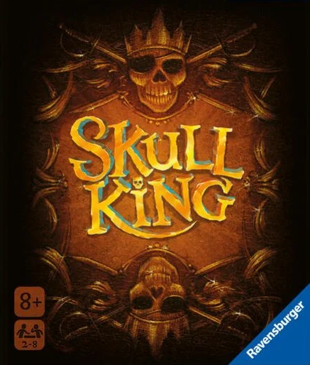

[](https://coveralls.io/github/Sloppy-Games-Interactive/Skull-King?branch=develop)
[](https://app.codacy.com/gh/Sloppy-Games-Interactive/Skull-King/dashboard?utm_source=gh&utm_medium=referral&utm_content=&utm_campaign=Badge_grade)


---

## sbt project compiled with Scala 3

### Usage

This is a normal sbt project. You can compile code with `sbt compile`, run it with `sbt run`, and `sbt console` will start a Scala 3 REPL.

For more information on the sbt-dotty plugin, see the
[scala3-example-project](https://github.com/scala/scala3-example-project/blob/main/README.md).

This is the scull king game in scala. It is a card game. 


# Skull King - Digital Card Game (Educational Project)



Welcome to Skull King - the digital adaptation of the beloved card game! This project aims to bring the excitement and thrill of the Skull King card game to your computer screen, allowing you to enjoy endless rounds of strategic and entertaining gameplay.

## Features:
### Not yet implemented
1. **Digital Gameplay:** Experience the thrill of Skull King on your computer. Play anytime, anywhere!

2. **Single Player Mode:** Test your skills against computer-controlled opponents of varying difficulty levels.

3. **Multiplayer Mode:** Challenge friends or compete against players from around the world in online multiplayer mode.

4. **Customizable Rules:** Tailor the game to your preferences with customizable rule settings.

5. **Beautiful Design:** Enjoy stunning graphics and intuitive user interface designed for seamless gameplay experience.

## How to Play:

Skull King is a trick-taking game played with a standard deck of cards. The objective is to accurately predict the number of tricks you will win each round. However, beware of the Skull King, as it can either earn you bonus points or lead to disaster!

1. **Setup:** Decide on the number of rounds to play and the scoring system.

2. **Dealing:** Each player is dealt a hand of cards.

3. **Bidding:** Players predict the number of tricks they will win in the round.

4. **Gameplay:** Play cards in turn, following suit if possible. The highest card of the leading suit wins the trick, unless a pirate or the Skull King is played.

5. **Scoring:** Points are awarded based on successful bids and penalties are applied for failed bids.

6. **Winning:** The player with the highest score at the end of the predetermined number of rounds wins the game.

## ~~Contributing~~:
**At the moment, we cant accept any contributions because the project is still in development 
for the educational purpose of the HTWG Konstanz.**

~~We welcome contributions from the community to improve and expand Skull King. Whether you're a developer, 
designer, or enthusiast, there are plenty of ways to get involved:~~

- **Code:** Help us improve the game mechanics, optimize performance, or add new features.
- **Graphics:** Contribute new artwork, animations, or visual effects to enhance the game's aesthetics.
- **Testing:** Report bugs, provide feedback, and help us ensure the game runs smoothly on all platforms.

## Getting Started:

To start playing Skull King, simply clone this repository to your local machine and follow the instructions in the README.md file.

```bash
git clone https://github.com/Sloppy-Games-Interactive/Skull-King.git
cd skull-king
sbt run
```

## License:
This project is licensed under the GNU GENERAL PUBLIC LICENSE - see the [LICENSE](LICENSE) file for details.

## Contact:
For questions, feedback, or support, please contact us at 
[philippe.westenfelder@htwg-konstanz.de](mailto:philippe.westenfelder@htwg-konstanz.de).

Let the games begin! 🏴‍☠️👑